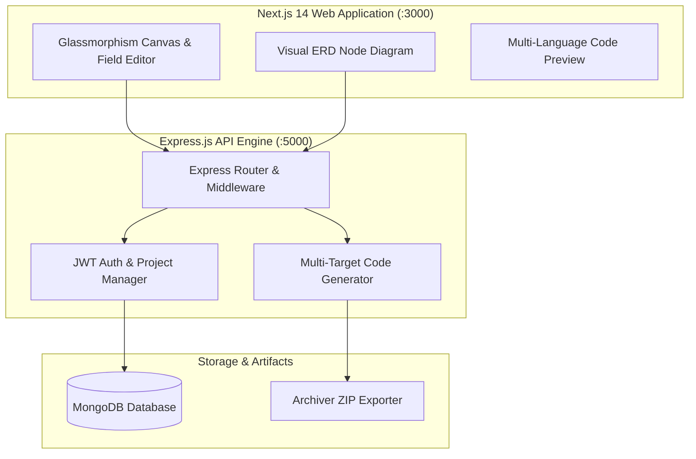

<div align="center">

  <h1>⚡ MicroForge / SchemaForge</h1>
  <p><strong>Next-Gen AI Visual Schema Designer, ORM Compiler & API Generator</strong></p>

  <p>
    <a href="https://github.com/Vishaldubey2210/MicroForge_hackthone/actions"></a>
    <a href="#-tech-stack"></a>
    <a href="#-tech-stack"></a>
    <a href="#-tech-stack"></a>
    <a href="#-tech-stack"></a>
    <a href="#-tech-stack"></a>
    <a href="#-tech-stack"></a>
    <a href="#-license"></a>
  </p>

</div>

---

## 📌 Overview
**SchemaForge** transforms how developers and engineering teams architect databases. Visually forge relational and document schemas, define data types, configure constraints, and instantly export production-grade models in:

- **Prisma ORM** (`schema.prisma`)
- **Mongoose / MongoDB** (`models.js`)
- **PostgreSQL / MySQL / SQLite DDL** (`schema.sql`)
- **TypeScript Interfaces & DTOs** (`types.ts`)
- **GraphQL Schema SDL** (`schema.graphql`)
- **Zod Schemas** (`validation.ts`)
- **Python Pydantic Models** (`models.py`)
- **Synthetic Mock Data** (`mock.json`)

---

## 🏛️ System Architecture



---

## 🚀 Quickstart

```bash
# Clone repository
git clone https://github.com/Vishaldubey2210/MicroForge_hackthone.git
cd MicroForge_hackthone

# Install all dependencies
npm install

# Start both frontend and backend concurrently
npm run dev
```

- **Frontend Application**: `http://localhost:3000`
- **Backend REST API**: `http://localhost:5000/api`

---

## 📜 License
Distributed under the **MIT License**.
